<div align="center">

# DAAO

### Distributed AI Agent Orchestration

**Control any machine, from anywhere — secure terminals, AI agents, and live telemetry via Zero-Trust gRPC tunnels.**

[](LICENSE)
[](https://go.dev)
[](https://react.dev)
[](https://www.postgresql.org)

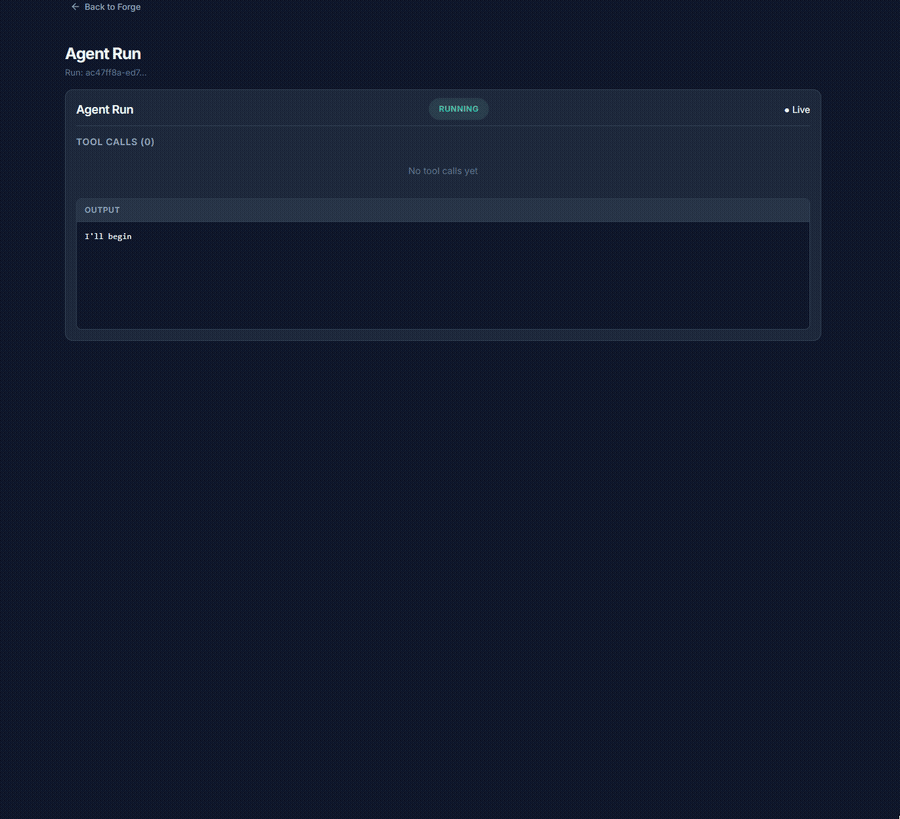

</div>

---

DAAO deploys a lightweight Go binary to any server — Windows, Linux, or macOS — and connects it back to a central control plane via outbound-only mTLS gRPC tunnels. No inbound ports. No VPN. No SSH.

From the web Cockpit, you deploy AI agents, create terminal sessions, stream live output, manage session lifecycles, view recordings, and monitor satellite telemetry — all in real-time.

## ✨ Features

| Feature | Description |
|---------|-------------|
| **Cross-Platform Satellite** | Single Go binary (`<20MB`). Windows (ConPTY), Linux, macOS (POSIX PTY). Zero dependencies on the host. |
| **Zero-Trust Networking** | Outbound-only gRPC reverse tunnels with mTLS. Satellites open no inbound ports. |
| **Web Cockpit** | React + xterm.js dashboard with live terminal streaming, session management, and multi-pane views. |
| **Agent Forge** | Deploy AI agents to satellites — infrastructure discovery, log analyzers, security scanners, virtual sysadmins. Auto-provisions the runtime on first deploy. |
| **Context System** | Per-satellite context files (`systeminfo.md`, `runbooks.md`) synced bidirectionally via gRPC. Agents read and write context automatically. |
| **Session Lifecycle** | Create, attach, detach, suspend, resume, kill. Sessions survive browser disconnects. |
| **Session Recordings** | Automatic asciicast v2 capture with full playback — play, pause, scrub, speed control. |
| **Satellite Telemetry** | Real-time CPU, memory, disk, and GPU metrics with live charts per satellite. |
| **Multi-User Auth** | JWT + mTLS authentication, OIDC integration, RBAC, and audit logging. |
| **Notifications** | Server-Sent Events (SSE) push notifications with in-app bell, panel, and browser alerts. |
| **Multi-Session Dashboard** | View 1–6 concurrent terminal sessions in a responsive grid layout. |
| **Session Pipelines** | Chain sessions and agent runs into automated workflows. |
| **Auto-Update** | Satellites self-update via `daao update` with rollback support. |
| **Security Hardened** | CSP, HSTS, input validation, request body limits, WebSocket read limits, rate limiting. |

## 📸 Screenshots

<details>
<summary><b>Dashboard</b> — System overview with session status and satellite health</summary>

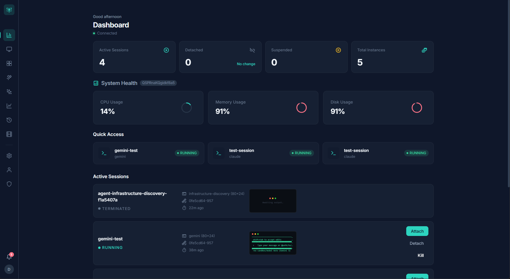
</details>

<details>
<summary><b>Sessions</b> — Manage active and historical terminal sessions</summary>

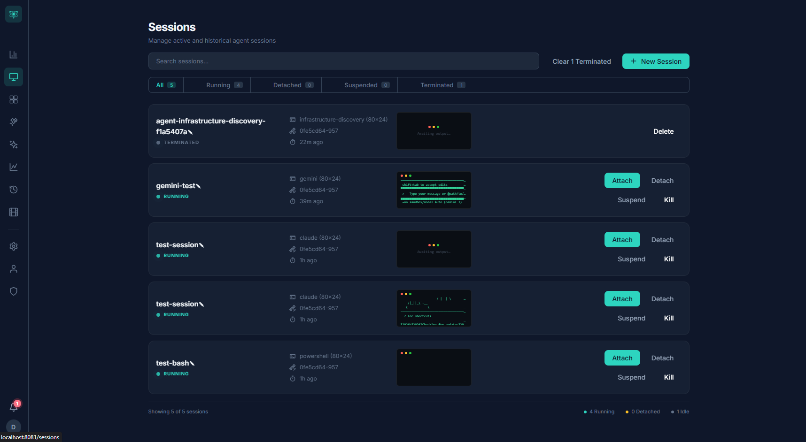
</details>

<details>
<summary><b>Multi-Session</b> — Up to 6 live terminals side-by-side</summary>

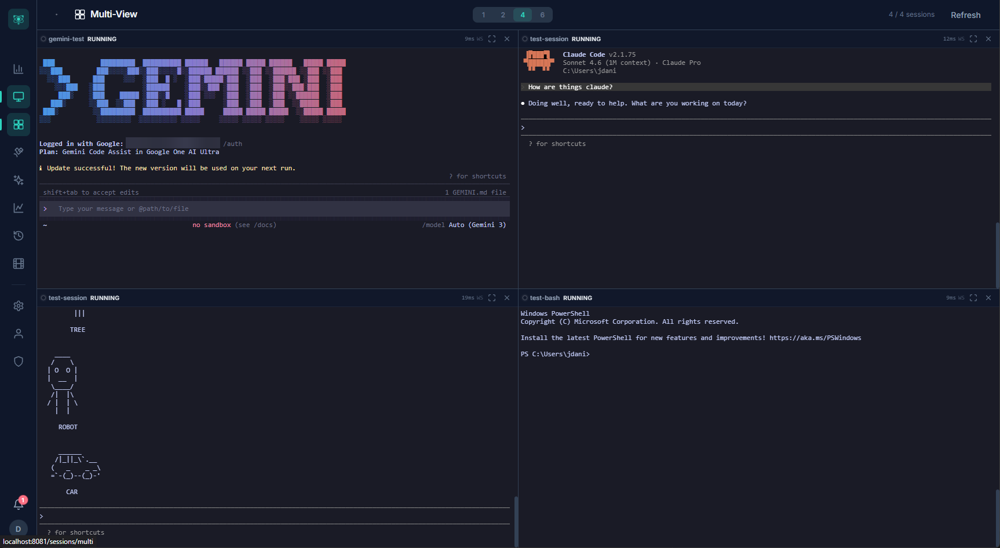
</details>

<details>
<summary><b>Satellites</b> — Monitor registered remote machines</summary>

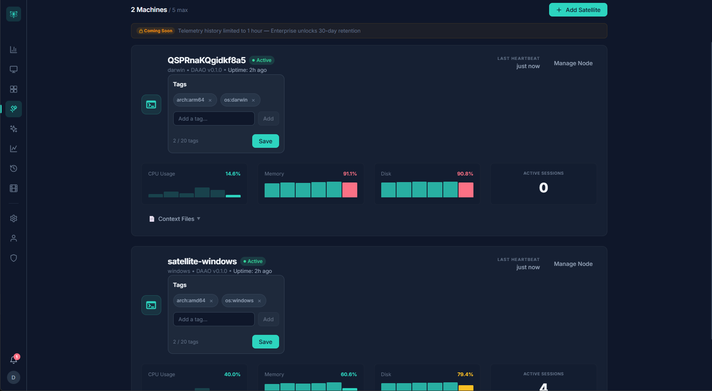
</details>

<details>
<summary><b>Agent Forge</b> — Deploy AI agents to any satellite</summary>

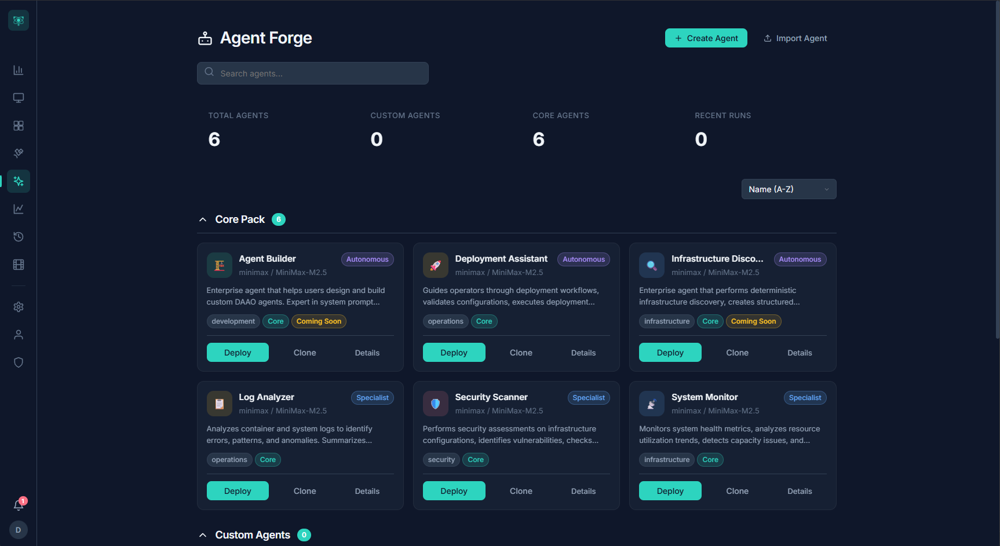
</details>

<details>
<summary><b>Agent Run</b> — Live streaming agent output with tool call inspection</summary>

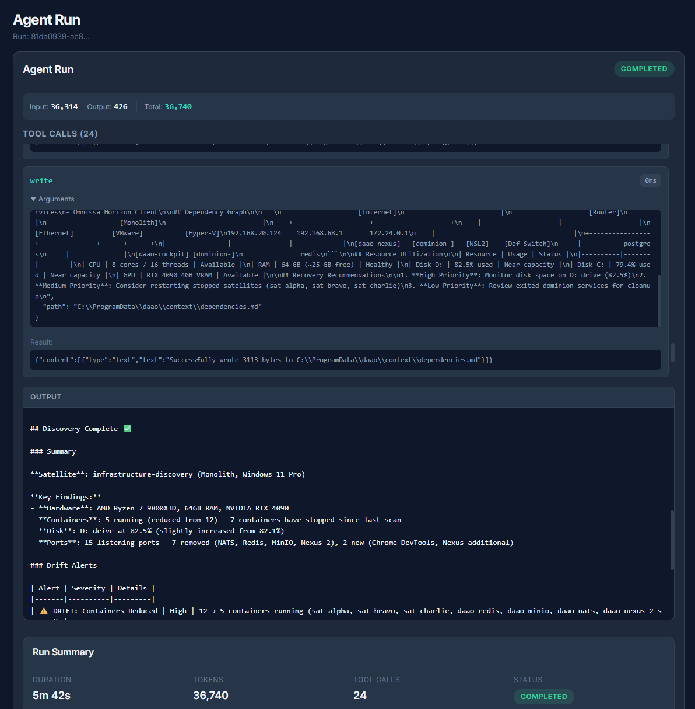
</details>

<details>
<summary><b>Recordings</b> — Session recording playback with scrubbing controls</summary>

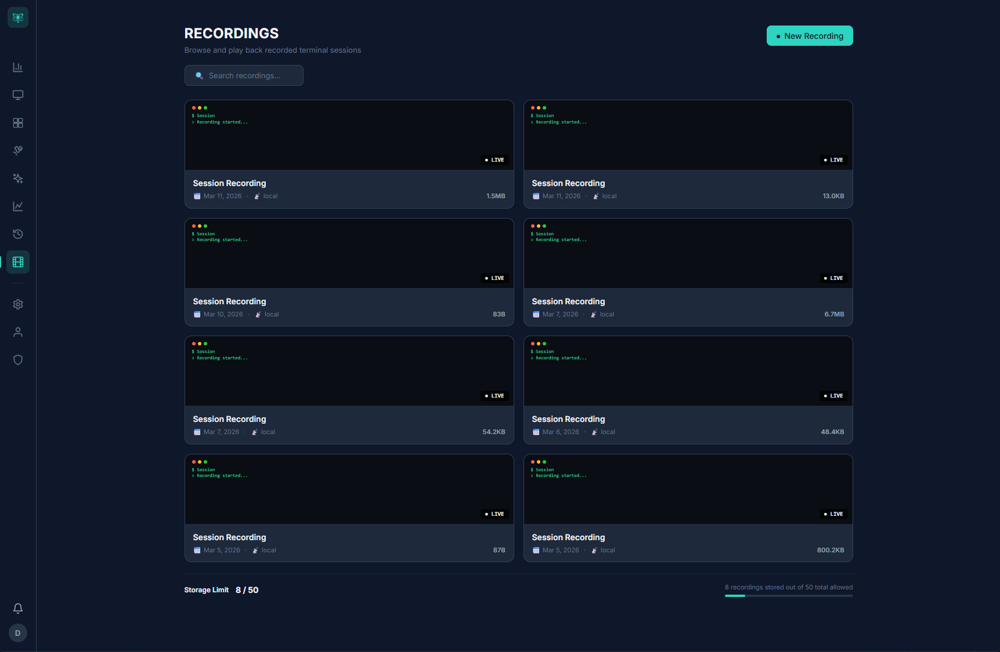
</details>

<details>
<summary><b>Pipelines</b> — Chain sessions and agents into automated workflows</summary>

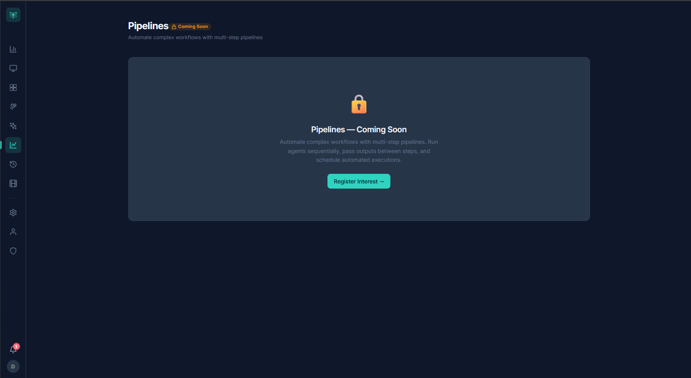
</details>

<details>
<summary><b>Audit Log</b> — Immutable record of all administrative actions</summary>

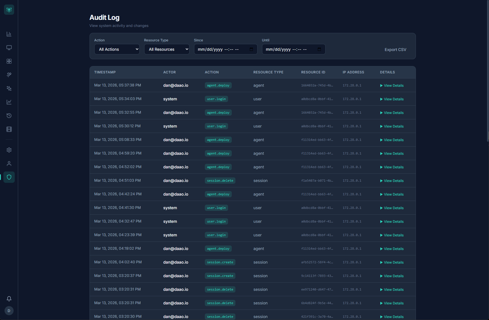
</details>

## 🏗️ Architecture

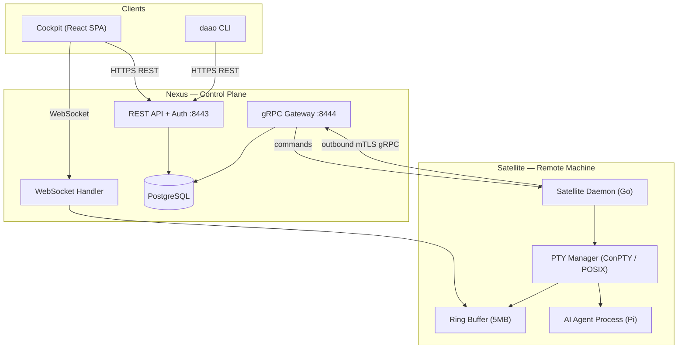

## 🚀 Quick Start

### Prerequisites

- [Docker](https://docs.docker.com/get-docker/) and Docker Compose
- Go 1.26+ (for local development only)
- Node.js 22+ (for Cockpit development only)

### 1. Clone and configure

```bash
git clone https://github.com/daao-platform/daao.git
cd daao
cp .env.example .env
```

Edit `.env` and set **at minimum**:
- `JWT_SECRET` — a strong random string (≥32 characters)
- `POSTGRES_PASSWORD` — your database password

### 2. Start the stack

```bash
docker compose up -d
```

This starts PostgreSQL, Nexus (API + gRPC), and Cockpit (web UI).

### 3. Open the Cockpit

Navigate to **http://localhost:8081** in your browser.

### 4. Connect a Satellite

Download the satellite binary for your platform and register it with Nexus:

```bash
# Register this machine with Nexus (run once)
./daao login

# Start the satellite daemon
./daao start
```

See [Satellite Setup Guide](docs/SATELLITE_SETUP.md) for the full walkthrough including certificate setup.

## 📖 Documentation

| Document | Description |
|----------|-------------|
| [Architecture](docs/ARCHITECTURE.md) | System design, component diagrams, data flow, state machines |
| [API Reference](docs/API_REFERENCE.md) | REST API endpoints and request/response schemas |
| [Database](docs/DATABASE.md) | PostgreSQL schema, migrations, and data model |
| [Deployment](docs/DEPLOYMENT.md) | Production deployment guide |
| [Development](docs/DEVELOPMENT.md) | Local development setup and workflow |
| [Satellite Setup](docs/SATELLITE_SETUP.md) | Installing and configuring the satellite daemon |
| [Scaling](docs/SCALING.md) | Performance tuning and concurrent session limits |
| [Security](docs/SECURITY.md) | Auth model, mTLS, JWT, rate limiting, hardening |
| [Testing](docs/TESTING.md) | Test strategy and running the test suite |
| [Roadmap](docs/ROADMAP.md) | What's shipping, what's next |

## 🛠️ Development

```bash
# Build all binaries
make build

# Run Go tests
go test ./...

# Run Cockpit dev server
cd cockpit && npm install && npm run dev

# Rebuild and restart Docker stack
docker compose up -d --build
```

> **Note:** `go vet` may report a false positive on `pkg/pty/pty_windows.go` regarding `unsafe.Pointer` usage.
> This is correct ConPTY API usage — the `HPCON` handle must be cast through `uintptr`. The project includes
> a `.golangci.yml` that suppresses this warning when using `golangci-lint`.

## 🤝 Contributing

We welcome contributions! See [CONTRIBUTING.md](CONTRIBUTING.md) for guidelines.

## 📄 License

DAAO is licensed under the [Business Source License 1.1](LICENSE).

- ✅ Self-host, modify, and use internally — free forever
- ✅ Contribute back via pull requests
- ❌ Offer as a competing hosted/managed service (requires commercial license)
- 🔄 Automatically converts to Apache 2.0 on 2030-03-06

### Community vs Enterprise

| Capability | Community | Enterprise |
|------------|:---------:|:----------:|
| Terminal sessions (PTY) | ✅ | ✅ |
| Session recordings | ✅ | ✅ |
| Satellite telemetry | ✅ | ✅ |
| Context system | ✅ | ✅ |
| Agent Forge (3 built-in agents) | ✅ | ✅ |
| OIDC / multi-user auth | ✅ | ✅ |
| Push notifications | ✅ | ✅ |
| Session pipelines | ✅ | ✅ |
| Human-in-the-Loop (HITL) guardrails | — | ✅ |
| Vault integrations (HashiCorp, Azure, Infisical) | — | ✅ |
| Scheduled & event-triggered agents | — | ✅ |
| Custom agent builder | — | ✅ |
| HA clustering (NATS, S3, Redis) | — | ✅ |
| Read replica support | — | ✅ |

Enterprise features are in active development. See [ROADMAP.md](docs/ROADMAP.md) for timeline.

## ⚠️ Disclaimer

DAAO is provided **"AS IS"**, WITHOUT WARRANTY OF ANY KIND, express or implied, including but not limited to the warranties of merchantability, fitness for a particular purpose, and noninfringement. See [LICENSE](LICENSE) for full terms. The authors are not liable for any damages resulting from use of this software on your infrastructure.
