# Architecture

> System architecture, component interaction diagrams, data flow, and state machine specifications.

---

## System Overview

DAAO follows a **hub-and-spoke architecture** where Nexus acts as the central API gateway, Satellites are the remote execution agents, and Cockpit is the web-based control plane.

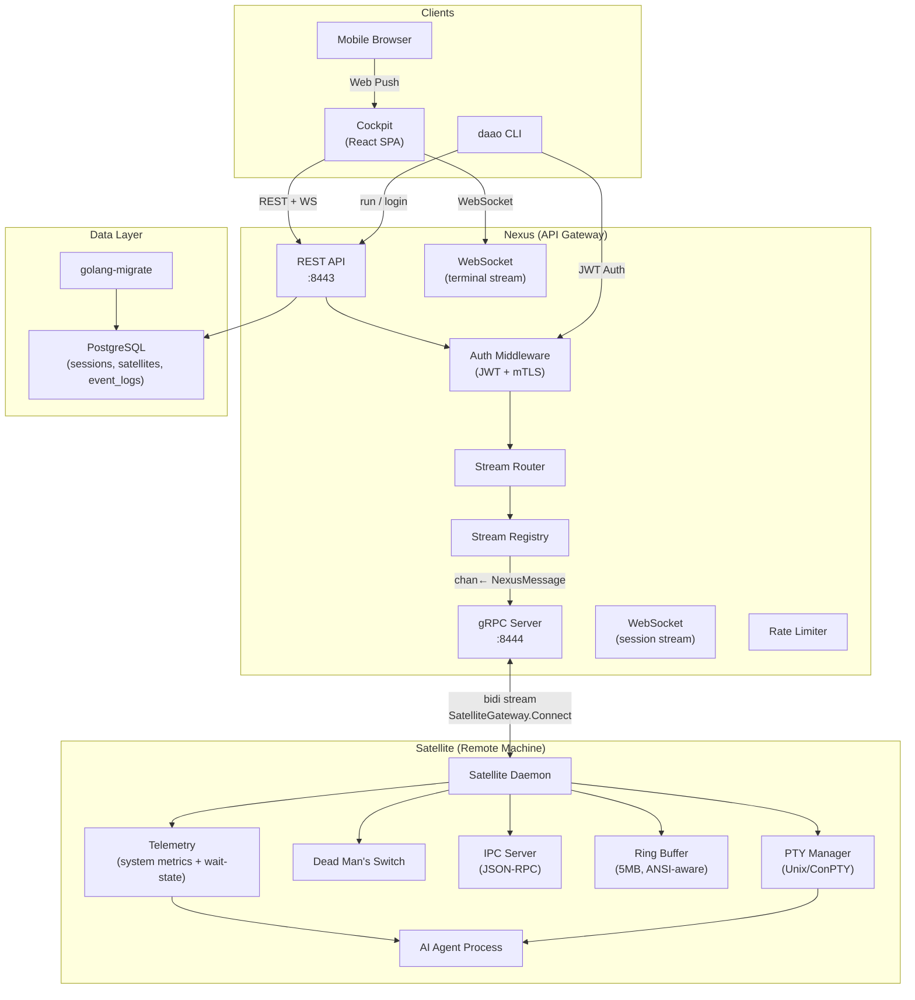

---

## Component Deep Dive

### Nexus — API Gateway

Nexus is the central server that orchestrates all communication. It runs three server protocols simultaneously:

| Protocol | Port | Purpose |
|---|---|---|
| **HTTPS (REST)** | `:8443` | Session CRUD, satellite listing, health checks |
| **gRPC** | `:8444` | Bidirectional streaming with Satellites |
| **WebSocket** | `:8443` | Real-time terminal streaming to Cockpit |
| **WebTransport** | `:8443` | Low-latency terminal streaming (HTTP/3, secondary) |

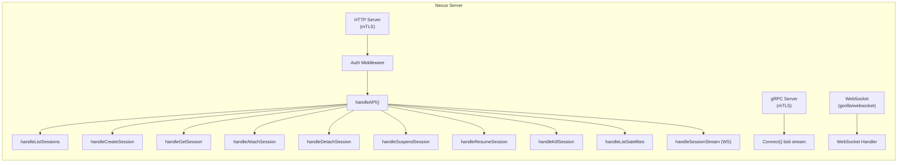

**Key Internal Structs:**

| Struct | Responsibility |
|---|---|
| `NexusServer` | Main server; embeds HTTP, gRPC, WebTransport servers |
| `StreamRegistry` | Maps sessionID → gRPC channel for message routing |
| `JWTTokenValidator` | Validates Cockpit user JWT tokens |
| `SatelliteCertValidator` | Validates Satellite mTLS client certificates |
| `RateLimiter` | Token-bucket rate limiting per satellite and per user |

---

### Satellite Daemon

The Satellite daemon runs on the remote execution machine. It manages PTY sessions, maintains a persistent gRPC connection to Nexus, and handles process lifecycle.

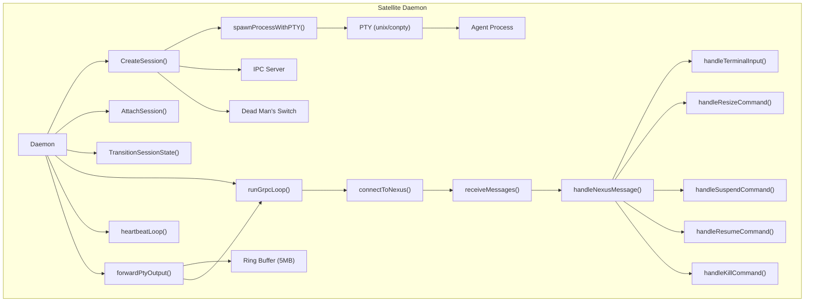

**Session Struct:**

```go
type Session struct {
    ID         string
    Pty        *os.File          // PTY file descriptor
    IPCServer  *ipc.Server       // JSON-RPC IPC endpoint
    RingBuffer *buffer.RingBuffer // ANSI-aware scrollback
    DMS        *lifecycle.DeadManSwitch
    Process    *os.Process
    State      session.SessionState
}
```

---

### Cockpit — Web Dashboard

The Cockpit frontend is a **React 19 + Vite + TypeScript** single-page application served by Nginx.

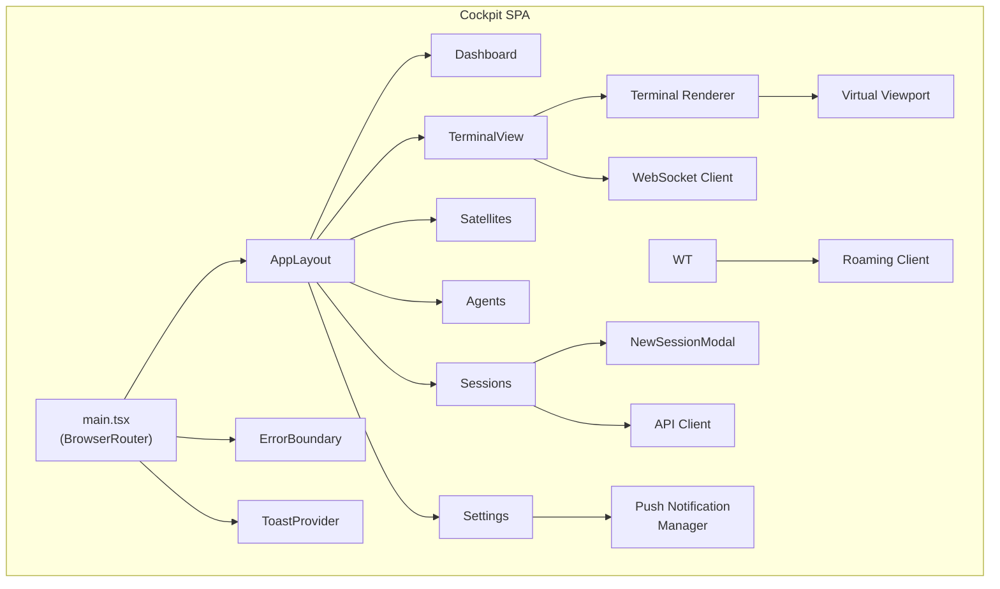

**Pages:**

| Page | Route | Description |
|---|---|---|
| Dashboard | `/` | Overview with session stats, recent activity |
| Sessions | `/sessions` | Session list with state management actions |
| Satellites | `/satellites` | Registered satellite machines |
| Agents | `/agents` | AI agent configurations |
| Settings | `/settings` | User preferences, push notification config |
| TerminalView | `/session/:sessionId` | Live terminal with WebSocket streaming |

---

## Data Flow

### Session Create → Terminal Stream

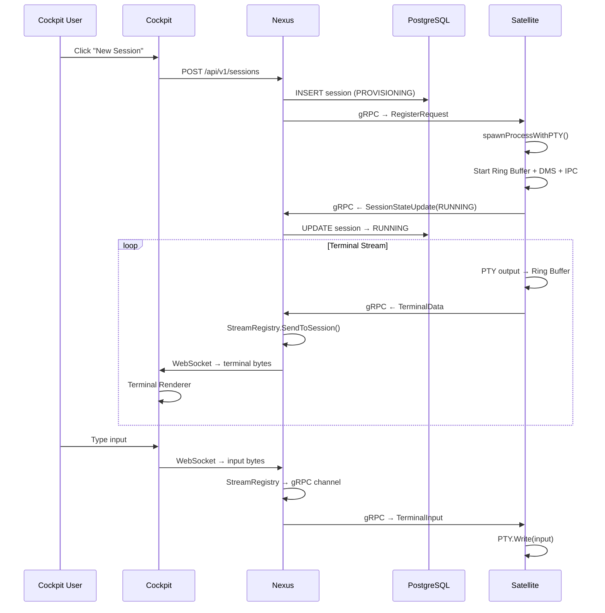

### Detach → DMS → Suspend → Resume

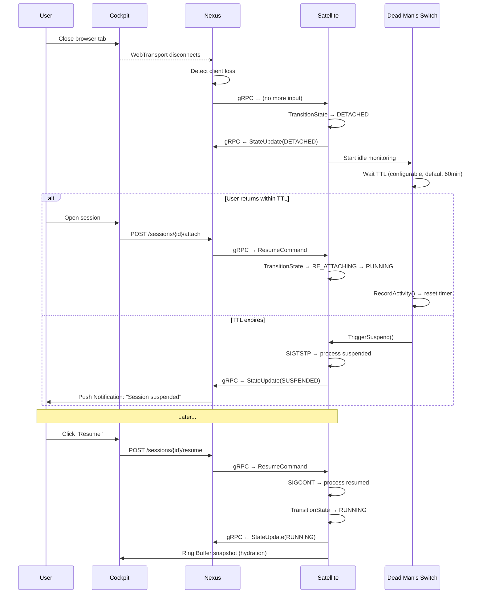

---

## Session State Machine

Sessions follow a strict finite state machine with validated transitions:

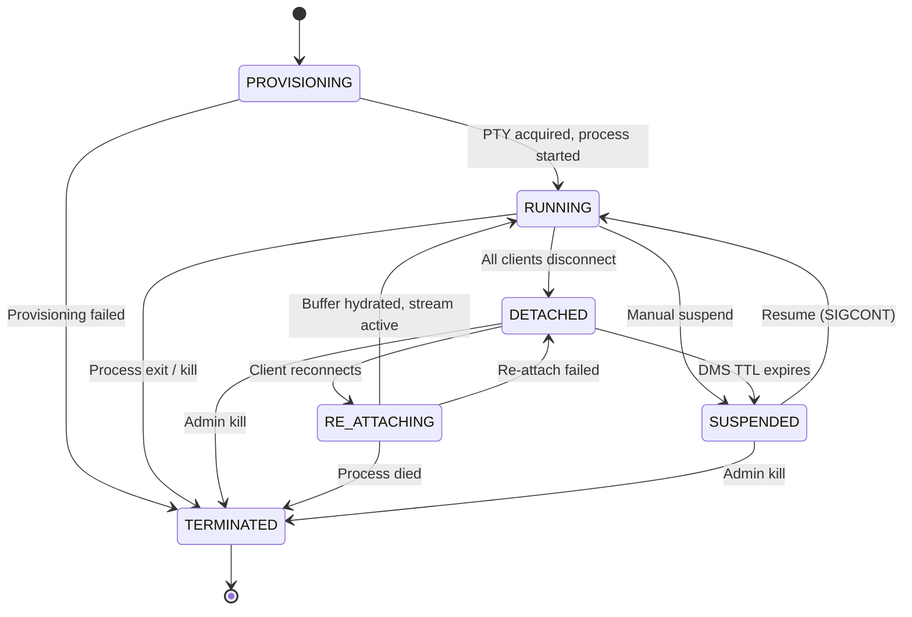

**Transition Validation:**

```go
var ValidTransitions = map[SessionState][]SessionState{
    StateProvisioning: {StateRunning, StateTerminated},
    StateRunning:      {StateDetached, StateSuspended, StateTerminated},
    StateDetached:     {StateReAttaching, StateSuspended, StateTerminated},
    StateReAttaching:  {StateRunning, StateDetached, StateTerminated},
    StateSuspended:    {StateRunning, StateTerminated},
    StateTerminated:   {}, // Terminal — no transitions out
}
```

---

## gRPC Protocol

The `SatelliteGateway` service uses a single **bidirectional streaming RPC**. The satellite initiates the outbound-only connection (Zero-Trust — no inbound ports required on the satellite machine).

```protobuf
service SatelliteGateway {
  rpc Connect(stream SatelliteMessage) returns (stream NexusMessage);
}
```

### Satellite → Nexus Message Types

| Message | Channel | Purpose |
|---|---|---|
| `RegisterRequest` | Priority | Satellite identity (ID, fingerprint, version, OS, arch) |
| `HeartbeatPing` | Priority | Keep-alive with timestamps |
| `SessionStateUpdate` | Priority | Session state machine transitions |
| `TelemetryReport` | Priority | CPU/MEM/DISK/GPU metrics |
| `TerminalData` | Bulk | PTY output bytes with sequence numbers |
| `BufferReplay` | Bulk | Ring buffer snapshot on reconnect (session hydration) |
| `IpcEvent` | Bulk | IPC events between processes |
| `AgentEvent` | Agent (isolated) | Pi RPC events: agent_start, message_update, tool_execution_start/end, agent_end |
| `ContextFileUpdate` | Bulk | fsnotify-triggered context file sync from satellite filesystem |

### Nexus → Satellite Message Types

| Message | Purpose |
|---|---|
| `TerminalInput` | User keystrokes from Cockpit |
| `ResizeCommand` | Terminal dimension changes |
| `SuspendCommand` | Suspend a session |
| `ResumeCommand` | Resume a suspended session |
| `KillCommand` | Terminate a session |
| `StartSessionCommand` | Create and start a new PTY session |
| `UpdateAvailable` | Notify satellite a new binary version is available |
| `SessionReconciliation` | List of active session IDs — satellite prunes orphans |
| `DeployAgentCommand` | Deploy a Pi RPC agent: agent definition + secrets |
| `ContextFilePush` | Push an updated context file from Cockpit to satellite disk |

### Three-Channel Priority Architecture

The satellite daemon uses three separate outbound channels drained by a single `streamWriter` goroutine. This prevents high-volume PTY output from starving control messages, and isolates agent event bursts from the terminal stream:

```
sendPriorityCh  (64 slots)  — heartbeats, state updates, telemetry  → never dropped
agentEventCh    (512 slots) — Pi RPC agent events                   → dropped gracefully under pressure
sendCh          (256 slots) — PTY output, buffer replays            → bulk
```

`streamWriter` drains `sendPriorityCh` first, then round-robins between `agentEventCh` and `sendCh`. When `agentEventCh` fills (agent flooding events faster than gRPC can send), events are dropped — acceptable because the DB is the source of truth and a dropped live event only means slightly stale display, not data loss.


---

## Pi RPC Bridge

The satellite daemon can spawn Pi processes in RPC mode and bridge their JSON stdin/stdout event stream to Nexus.

```
Nexus ──DeployAgentCommand──▶ daemon.go
                                 │
                                 ▼
                          PiBridge.Start()
                                 │
                    ┌────────────┴────────────┐
                    │   Pi process (Node.js)  │
                    │   stdin ◀── JSON cmds   │
                    │   stdout ──▶ JSON events│
                    └────────────┬────────────┘
                                 │
                          bridge.Events()
                                 │
                                 ▼
                    sendToNexus(AgentEvent) ──▶ Nexus gateway
```

**Key files:**
- `internal/satellite/pi_bridge.go` — PiBridge struct, Start(), Events(), Stop()
- `internal/satellite/runtime.go` — runtime config (enabled/disabled per satellite)
- `cmd/daao/daemon.go` — handleDeployAgentCommand(), bridges map, runContextWatcher()
- `extensions/` — DAAO Pi extension pack (TypeScript): daao-telemetry, daao-guardrails, daao-hitl-gate, daao-output-router, daao-context-loader, daao-sandbox

**Active bridges** are tracked in `Daemon.bridges map[string]*satellite.PiBridge`, keyed by session ID. On daemon shutdown, all bridges are stopped before the gRPC connection closes.

---

## Context System

Each satellite maintains a context directory (`/etc/daao/context/` on Linux/macOS, `C:\ProgramData\daao\context\` on Windows) containing markdown files that give AI agents situational awareness about the host.

**Standard files seeded on first start:**

| File | Purpose |
|------|---------|
| `systeminfo.md` | Role, services, hardware, network |
| `runbooks.md` | SOPs and operational procedures |
| `alerts.md` | Known alert conditions + resolution steps |
| `topology.md` | Network relationships and dependencies |
| `secrets-policy.md` | Credential references (no actual values) |
| `history.md` | Recent changes, deployments, incidents |
| `monitoring.md` | Metrics, thresholds, dashboards |
| `dependencies.md` | Upstream/downstream service dependencies |

**Bidirectional sync:**

```
Satellite filesystem  ←──fsnotify──▶  context_watcher.go
                                           │
                              gRPC ContextFileUpdate
                                           │
                                    Nexus gateway
                                           │
                               DB upsert (ON CONFLICT)
                                           │
                          ◀── gRPC ContextFilePush ──  Cockpit PUT /context/:id
```

- **Satellite → Nexus:** `fsnotify` with 300ms debounce (collapses Windows write+rename events). On reconnect, all current files are sent as a bulk sync.
- **Nexus → Satellite:** `ContextFilePush` dispatched from `ContextHandler.handleUpdateContextFile()` via `StreamRegistry.SendToSatellite()` after every DB write.
- **Path traversal protection:** `handleContextFilePush` validates that the file path is a plain filename (no `../` etc.) before writing to disk.

**Key files:**
- `internal/satellite/context_watcher.go` — ContextWatcher, SeedStandardFiles, ReadAllContextFiles
- `internal/api/context.go` — REST CRUD handlers + ContextFilePush dispatch
- `cockpit/src/components/ContextEditor.tsx` — editor with standard file quick-picks + version history

---

## Agent Event Streaming

Real-time streaming of Pi RPC agent events from satellite to Cockpit browser.

**Flow:**
```
Pi events ──agentEventCh──▶ gateway ──▶ {async DB write + in-memory pub/sub}
                                                        │
                                          GET /api/v1/runs/:id/stream (SSE)
                                                        │
                                              Cockpit AgentRunView
```

Agent event writes are batched at 100ms intervals using `database.BatchEventWriter` to reduce database round-trips under high event throughput.

The SSE endpoint replays full event history from `agent_run_events` on subscribe (late joiners, tab reload, reconnects all work), then streams live events as they arrive.

**SSE Authentication:** `EventSource` cannot send `Authorization` headers. Authentication uses an `HttpOnly; Secure; SameSite=Strict` cookie (`daao_auth`) set by `POST /api/v1/auth/cookie` after OIDC token exchange. The auth middleware falls back to this cookie when no `Authorization` header is present.

---

## Package Architecture

### `pkg/` — Reusable Libraries

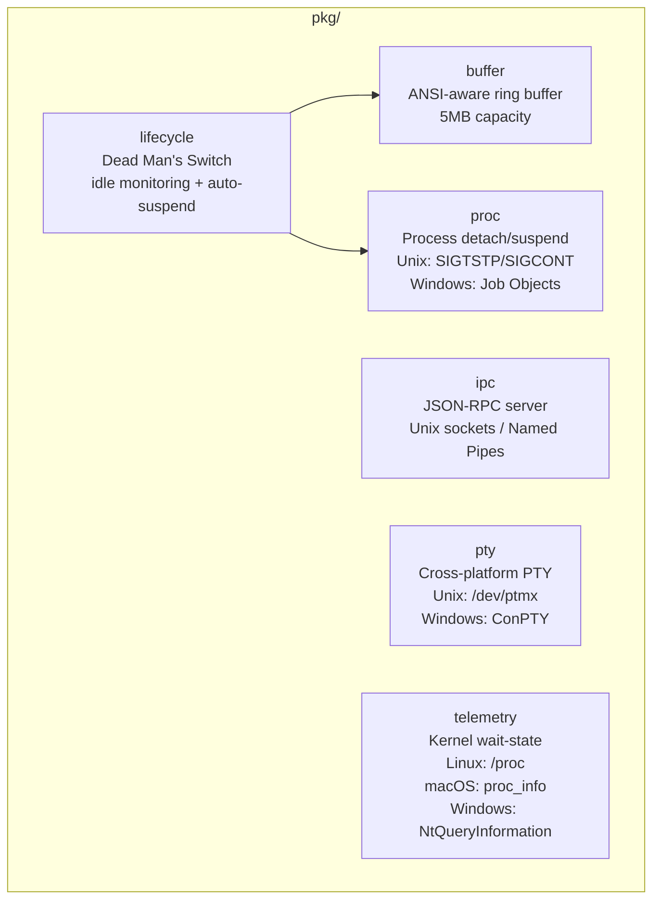

### `internal/` — Server-Specific Code

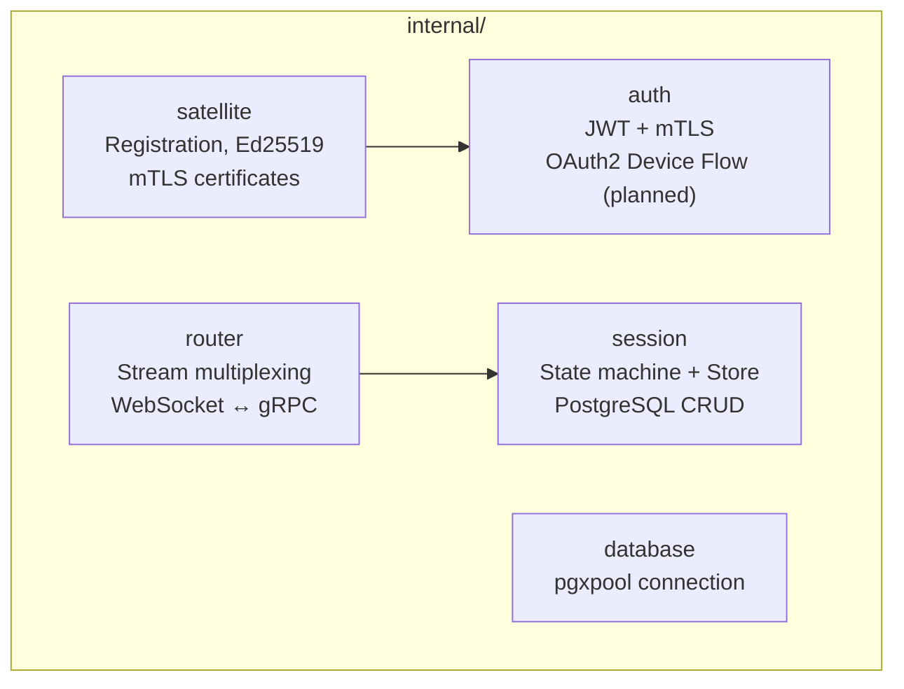

---

## Deployment Architecture

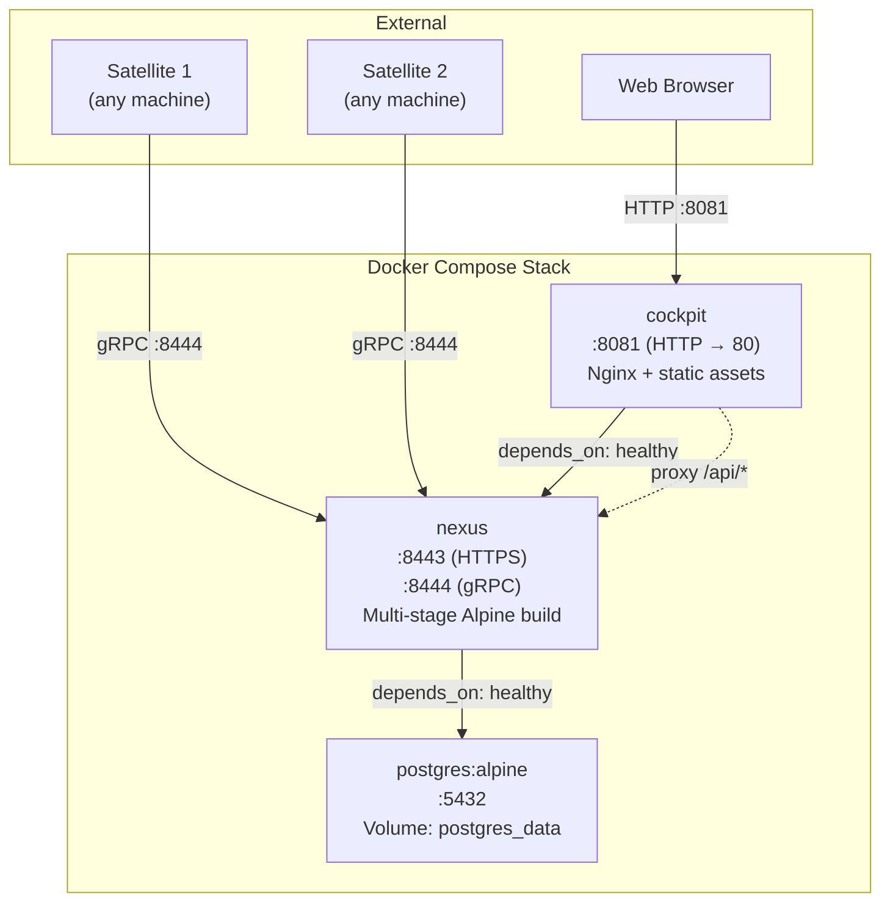

---

## Technology Stack

| Layer | Technology | Version |
|---|---|---|
| **Language** | Go | 1.26 |
| **Frontend** | React + TypeScript | 19 |
| **Build Tool** | Vite | Latest |
| **Database** | PostgreSQL + TimescaleDB (optional) | Latest stable |

When `TIMESCALEDB_ENABLED=true`, the `satellite_telemetry` table is converted to a TimescaleDB hypertable for efficient time-series queries at scale.

| **Migrations** | golang-migrate | v4 |
| **RPC** | gRPC + Protobuf | 1.78 |
| **Transport** | WebSocket (primary) + WebTransport (HTTP/3) | gorilla/websocket 1.5, quic-go |
| **Auth** | JWT + mTLS (OAuth2 Device Flow planned) | |
| **Crypto** | Ed25519 keys, x509 certificates | |
| **Container** | Docker + Docker Compose | |
| **Reverse Proxy** | Nginx | Alpine |

| **Testing** | testcontainers-go (Postgres) | v0.35 |

---

## HA & Scaling (Enterprise)

> Requires enterprise license with `FeatureHA`. See [SCALING.md](./SCALING.md) for detailed limits and connection math.

Community DAAO runs a single Nexus instance. Enterprise enables multi-instance clustering:

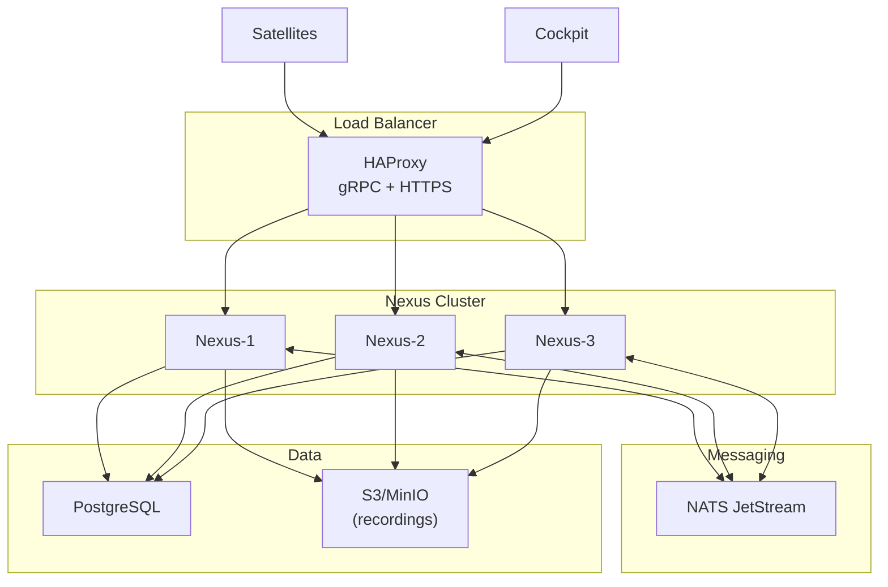

### Read Replica Support

For improved read throughput at scale, Nexus supports an optional read replica PostgreSQL instance. When `DATABASE_READ_URL` is set, list handlers route read queries to the replica while writes continue to the primary database.

### Interface-Based Injection

All stateful components implement interfaces. Enterprise implementations are injected at startup based on license:

| Interface | Community | Enterprise |
|---|---|---|
| `StreamRegistryInterface` | In-memory Go channels | NATSStreamRegistry (`internal/enterprise/ha/`) |
| `AgentRunHubInterface` | In-memory subscriber map | NATSRunEventHub (`internal/enterprise/ha/`) |
| `RecordingPoolInterface` | Local filesystem | S3RecordingPool (`internal/enterprise/ha/`) |
| Rate limiter interface | In-memory token buckets | RedisRateLimiter (`internal/enterprise/ha/`) |
| Scheduler | In-memory cron (all instances) | LeaderSchedulerGuard + PG advisory lock (`internal/enterprise/ha/`) |

Phase 2 complete. Set `S3_ENDPOINT`/`S3_BUCKET` for S3 recordings, `REDIS_URL` for distributed rate limiting (both require enterprise license with `FeatureHA`).

Code lives in `internal/enterprise/ha/`. No API changes required.

