# DAAO Development Progress

> **Status Legend:**
> - ✅ Done — Completed and verified
> - 🔧 **In Progress** `(agent-id, date)` — An agent is actively working on this. **Do not start.**
> - 📋 **Ready for Taskmaster** `(agent-id, date)` — PRD + task DAG created, waiting for Dan to run Taskmaster
> - ⬜ Pending — Available for work
> - ⚠️ Blocked — Waiting on a dependency (see task DAG below)
>
> **Pipeline:** ⬜ → 🔧 (agent claims) → 📋 (PRD + DAG ready) → Dan runs Taskmaster → `/review-taskmaster` → ✅
>
> **Locking rule:** Before starting work on a ⬜ item, change it to 🔧 with your session ID and today's date.
> After creating a PRD + task DAG via `/prepare-taskmaster`, change to 📋.
> When Taskmaster finishes and review passes, change to ✅. If abandoned, change back to ⬜.

---

## Task Dependency DAG

Items at the top have no dependencies. Items below depend on items above them.

```mermaid
graph TD
    %% === COMPLETED (for reference) ===
    classDef done fill:#2d6a2d,stroke:#333,color:#fff
    classDef pending fill:#4a4a6a,stroke:#333,color:#fff
    classDef blocked fill:#6a4a2d,stroke:#333,color:#fff

    CORE["✅ Core Platform<br/>(sessions, terminals, satellites)"]:::done
    SEC["✅ Security Hardening<br/>(#33)"]:::done
    LIC["✅ License System<br/>(keygen, validation, gates)"]:::done
    TELE["✅ Satellite Telemetry<br/>(#24)"]:::done
    REC["✅ Session Recordings<br/>(#18)"]:::done
    NOTIF["✅ Notifications<br/>(#19)"]:::done
    FORGE_CORE["✅ Agent Forge Core<br/>(CRUD, deploy, Forge UI)"]:::done
    SECRETS["✅ Secrets Broker<br/>(encrypted provider configs)"]:::done

    %% === PENDING WORK ===
    AUTH["✅ #23 Multi-user Auth & RBAC"]:::done
    PI_RPC["✅ Pi RPC Bridge<br/>(Go ↔ Node.js stdin/stdout)"]:::done
    CONTEXT["✅ Context System<br/>(systeminfo.md sync)"]:::done
    AGENT_STREAM["✅ Agent Event Streaming<br/>(SSE per-run + DB persistence)"]:::done
    SIEM["⬜ SIEM Connectors<br/>(Splunk, Sentinel)"]:::pending
    DISCOVERY["⬜ Discovery / Audit Mode<br/>(AC-2)"]:::pending
    SCHED["✅ #25 Scheduled Sessions"]:::done
    FILE_BROWSER["⬜ #22 File Browser"]:::pending
    CHAIN["✅ #21 Session Chaining"]:::done
    AGENT_ROUTE["✅ #20 Agent Routing (GPU)"]:::done
    AGENT_REG["⬜ #27 Agent Registry"]:::pending
    MEMORY["⬜ #26 Session Memory"]:::pending
    ARK["⬜ #32 ARK Memory"]:::pending
    ANSIBLE["⬜ #29 Ansible Provisioning"]:::pending
    A2A["⬜ #30 A2A Protocol Integration"]:::pending
    PWA["⬜ #31 Mobile PWA"]:::pending
    SEC_TEST["⬜ Security Testing<br/>(OWASP ZAP, gosec)"]:::pending
    ORIGIN_FIX["✅ WebSocket Origin Fix<br/>(CSWSH)"]:::done
    JWT_FIX["✅ JWT Auth Migration<br/>(query params → first-message)"]:::done
    AGENT_GUARD["✅ Community Agent Guardrails"]:::done
    AUDIT_LOG["✅ Admin Audit Log"]:::done

    %% === DEPENDENCIES ===
    CORE --> AUTH
    CORE --> PI_RPC
    CORE --> FILE_BROWSER
    CORE --> SEC_TEST
    CORE --> ORIGIN_FIX
    CORE --> JWT_FIX

    LIC --> AUTH
    FORGE_CORE --> PI_RPC
    FORGE_CORE --> CONTEXT
    FORGE_CORE --> AGENT_REG
    FORGE_CORE --> AGENT_GUARD

    SECRETS --> PI_RPC

    PI_RPC --> AGENT_STREAM
    PI_RPC --> SCHED
    PI_RPC --> AGENT_ROUTE
    PI_RPC --> DISCOVERY

    AGENT_STREAM --> SCHED

    AUTH --> SIEM
    AUTH --> AUDIT_LOG
    TELE --> SIEM
    TELE --> DISCOVERY

    SCHED --> CHAIN
    CHAIN --> A2A
    AGENT_STREAM --> A2A
    MEMORY --> ARK

    CONTEXT --> MEMORY
    CONTEXT --> DISCOVERY

    %% === ENTERPRISE SCALING ===
    PHASE0["✅ Phase 0: Observability<br/>(slog, Prometheus, /health)"]:::done
    PHASE1["✅ Phase 1: NATS Pub/Sub<br/>(enterprise HA)"]:::done
    PHASE2["✅ Phase 2: Externalize State<br/>(S3, Redis, leader-elect)"]:::done
    PHASE3["✅ Phase 3: DB Scaling<br/>(replicas, TimescaleDB)"]:::done

    CORE --> PHASE0
    PHASE0 --> PHASE1
    PHASE1 --> PHASE2
    PHASE2 --> PHASE3
    LIC --> PHASE1
```



### Parallel-Safe Groups

These items can be worked on simultaneously without file conflicts:

| Group | Items | Key Files |
|-------|-------|-----------|
| **A** | WebSocket Origin Fix, JWT Auth Migration | ✅ Done |
| **B** | Pi RPC Bridge | ✅ Done |
| **C** | Context System | ✅ Done |
| **D** | Community Agent Guardrails | ✅ Done (2026-03-08) — 4/4 tasks merged |
| **E** | Security Testing (gosec, ZAP) | No code changes — scan only |
| **F** | Agent Event Streaming | ✅ Done |
| **G** | Admin Audit Log | ✅ Done (2026-03-08) — 7/7 tasks merged + 1 coach consult |

> D, E, F, G can all run in parallel.

---

## ⚠️ CRITICAL — Immediate Next Step

| # | Issue | Status | Notes |
|---|-------|--------|-------|
| **#34** | Session resilience: survive Nexus restarts | ✅ Done | Fixed 3 root causes: (1) `Connect()` passed nil dbPool — heartbeats never persisted, (2) daemon lacked session replay on reconnect — added `BufferReplay` proto + `replayActiveSessions()`, (3) sessions stuck as RUNNING after restart — added `recoverActiveSessions()` to transition to DETACHED on startup. |

## Tier 1 — Core Functionality

| # | Issue | Status | Notes |
|---|-------|--------|-------|
| **#8** | Terminal input: forward keystrokes | ✅ Already wired | Full path exists: xterm.js → WS → TerminalInput proto → satellite → pty.Write. Sessions register on first TerminalData from satellite. |
| **#3** | Terminal resize (ResizePseudoConsole) | ✅ Done | Fixed in `internal/transport/websocket.go`: WS handler now parses `{type:"resize"}` JSON and routes as `ResizeCommand` proto instead of forwarding raw bytes as `TerminalInput`. |
| **#10** | Stale satellite cleanup | ✅ Done | Added `startSatelliteLivenessChecker()` in `cmd/nexus/main.go`: background goroutine runs every 15s, marks satellites with `updated_at < NOW()-45s` as offline. |
| **#9** | Satellite auto-reconnect | ✅ Already done | daemon.go:427 has exponential backoff loop. Sessions re-register when satellite reconnects and resumes sending TerminalData. |

---

## Smoke Testing Notes

**Root cause found during testing:** `docker-compose.yml` binds `bin/nexus-linux-amd64` directly into the nexus container, overriding the Docker image binary. Always run `make build-nexus-linux` before restarting nexus after code changes.

**Go 1.22 mux bug:** PATCH requests are not forwarded through old-style trailing-slash subtree handlers. Fixed by handling PATCH explicitly in `handleSessionsSubpath`.

---

## Tier 2 — Session Experience

| # | Issue | Status | Notes |
|---|-------|--------|-------|
| **#11** | Session reattach | ✅ Done | On ws.onopen, DETACHED sessions call attachSession() → RUNNING; ring buffer replay was already working |
| **#14** | Session working directory | ✅ Done | proto field 6 + daemon cwd fallback + UI field in NewSessionModal |
| **#13** | Session naming / rename | ✅ Done | PATCH /sessions/{id}/name + inline edit in TerminalView toolbar + Sessions card |
| **#2** | Terminal visual artifacts | ✅ Done | allowTransparency:false, drawBoldTextInBrightColors:true, overviewRulerWidth:0 |
| **#5** | Real latency in status bar | ✅ Done | Ping every 10s, pong RTT measured, quality indicator (good/fair/poor) |

---

## Tier 3 — Developer & Operator Experience

| # | Issue | Status | Notes |
|---|-------|--------|-------|
| **#12** | Docker build includes binaries | ✅ Done | 3-stage `Dockerfile.cockpit`: Go cross-compile → Node build → nginx. Binaries built from source, no more stale cache. |
| **#6** | Serve binaries from release volume | ✅ Done | `releases` named volume in docker-compose + `COPY --from=go-builder` in Dockerfile. Nexus bind-mount removed. |
| **#16** | Document concurrent session limits | ✅ Done | `docs/SCALING.md` + `DAAO_MAX_SESSIONS` env var in daemon with early check in `CreateSession()` |
| **#7** | Linux/Darwin PTY build tag | ✅ Done | Renamed `pty_unix.go` → `pty_linux.go` (`//go:build linux`), new `pty_darwin.go` with cgo openpty |
| **#4** | ConPTY os.File.Fd() handle safety | ✅ Done | `CreatePseudoConsole` accepts raw `windows.Handle`, `CreatePipeRaw()` returns `syscall.Handle`, `runtime.KeepAlive` on `Fd()`/`SetReadDeadline()` |
| — | Satellite auto-update system | ✅ Done | `daao update/version/rollback` CLI commands, version embedded via `-ldflags`, Nexus sends `UpdateAvailable` via gRPC, rename-swap binary update (Windows-safe), `version.txt` served at `/releases/` |

---

## QA Fixes (Sprint 3)

| Fix | Status | Notes |
|-----|--------|-------|
| Session creation returns `undefined` | ✅ Fixed | Go ServeMux 301-redirected `POST /sessions` → `GET /sessions/`, dropping request body. Added exact-match route registration. |
| Suspend/Resume/Kill not reaching satellite | ✅ Fixed | Nexus handlers only updated DB — never dispatched gRPC commands to satellite. Added `SendToSatellite()` for all three. |
| Attach returns 500 on RUNNING session | ✅ Fixed | `RUNNING→RUNNING` is not a valid state transition. Handler now skips transition when already in target state. |
| Terminated sessions not in list | ✅ Fixed | SQL queries had `WHERE terminated_at IS NULL`. Removed filter so API returns all sessions; frontend tabs handle filtering. |
| Sessions page loading flicker | ✅ Fixed | `useApi` hook set `loading=true` on every refetch. Changed to only show loading skeleton on initial fetch. |

---

## Tier 4 — Dashboard & Visibility

| # | Issue | Status | Notes |
|---|-------|--------|-------|
| **#15** | Multi-session dashboard | ✅ Done | Full-bleed responsive grid layout, 1-6 panes with auto-sizing, per-pane xterm.js terminals, sidebar integration |
| **#24** | Satellite telemetry | ✅ Done | Real-time CPU/MEM/DISK/GPU via gRPC `TelemetryReport`, per-satellite detail page with live charts, `collector_*.go` per platform |
| — | Darwin satellite build | ✅ Done | Pure-Go PTY (`pty_darwin_nocgo.go`), darwin sysmetrics collector, Dockerfile cross-compiles 6 binaries (linux/darwin/windows × amd64/arm64) |
| **#18** | Session recording & playback | ✅ Done | asciicast v2 format, xterm.js player with FitAddon, play/pause/scrub/speed controls, Recordings sidebar page with search, accurate terminal dimension capture, `ON DELETE SET NULL` FK so metadata survives session deletion, startup disk reconciliation for orphaned .cast files, D: drive bind-mount for recordings storage |
| **#19** | Notifications & alerts | ✅ Done | Extensible notification engine: EventBus → NotificationService → Dispatcher interface (SSE first, Slack/webhook later). SSE real-time push, PgStore persistence, 7 REST API endpoints, bell icon with unread badge + dropdown panel, `/notifications` page with type/priority filters, browser Notification API for CRITICAL events. Event emitters on session kill/suspend + satellite liveness timeout. |

---

## Tier 5 — Multi-user & Security

| # | Issue | Status | Notes |
|---|-------|--------|-------|
| **#33** | Security hardening | ✅ Done | Fixed auth middleware OIDC bypass (invalid tokens accepted when `OIDC_ISSUER_URL` set). Added `SecurityHeadersMiddleware` (CSP, HSTS, Permissions-Policy, X-Frame-Options DENY, X-Content-Type-Options, Referrer-Policy, Cache-Control). Added `RequestBodyLimitMiddleware` (1 MB). WebSocket read limits (8 KB session, 64 KB terminal). Input validation: session/satellite name ≤255 chars, agent_binary path traversal rejection. Nginx hardened: CSP, HSTS, Permissions-Policy, `client_max_body_size 1m`. 6 new tests. |
| — | WebSocket Origin Validation (CSWSH) | ✅ Done (2026-03-07) — 8/8 tasks merged | Added `internal/transport/cors/check.go` with origin validation, unified origin checks in router and websocket handlers. Prevents Cross-Site WebSocket Hijacking attacks. |
| — | JWT Auth Migration | ✅ Done (2026-03-07) — 8/8 tasks merged | Moved JWT authentication from query parameters to first-message in WebSocket handshake. Frontend updated to send token via `connect` message. Eliminates token leakage in URLs/logs. |
| **#23** | Multi-user auth & teams | ✅ Done (2026-03-07) — 10/10 tasks merged, 1 coach consult. PRD: .pi/workspace/auth-rbac/prd.md. 3-role RBAC (owner/admin/viewer), user CRUD API, resource scoping, OIDC auto-provisioning, permission request flow |
| — | Admin Audit Log | ✅ Done (2026-03-08) — 7/7 tasks merged, 1 coach consult | Migration 024 `admin_audit_logs` table (actor, action, resource_type, resource_id, details, ip_address, user_agent). `internal/audit/logger.go` service with `Log()` method. REST API: `GET /api/v1/audit-logs` with filters (actor, action, resource_type, start/end date, pagination). Cockpit page with searchable table, columns: timestamp, actor, action, resource, details. Instrumented handlers: sessions, satellites, agents, users, providers. Sidebar navigation item. |
| — | Persistent DB & Auth Bootstrap | ✅ Done (2026-03-09) | DB persistence verified (Docker named volume + idempotent migrations). Satellite auto-registration via gRPC `INSERT ON CONFLICT (fingerprint)` — self-heals after volume wipe. Owner user bootstrap from `DAAO_OWNER_EMAIL` env var. Auth middleware injects owner identity in non-OIDC mode so RBAC works without SSO. |
| — | Satellite registration token | ⬜ Pending | Require `DAAO_REGISTRATION_TOKEN` pre-shared secret for `POST /api/v1/satellites` and gRPC auto-register. Currently open — any client that can reach port 8081/8444 can register a satellite. See SECURITY.md. |

---

## License & Enterprise Gating

| # | Issue | Status | Notes |
|---|-------|--------|-------|
| — | License key validation | ✅ Done | Ed25519-signed JWT validation in `internal/license/`. Supports community, team, and enterprise tiers with feature flags, user/satellite limits, and expiry. |
| — | Feature gating | ✅ Done | `features.go` defines 10 enterprise feature IDs. Community limits: 3 users, 5 satellites, 50 recordings, 1hr telemetry. Enterprise gates on Forge analytics, scheduler, vault integrations. |
| — | Keygen CLI | ✅ Done | `cmd/daao-keygen/` — `init` (generate Ed25519 keypair), `issue` (sign JWT), `verify` (decode + validate). Separate binary from Nexus. |
| — | Nexus license wiring | ✅ Done | Reads `DAAO_LICENSE_PUBLIC_KEY[_FILE]` and `DAAO_LICENSE_KEY[_FILE]` env vars at startup. Logs tier, customer, features, expiry. Cockpit reads via `/api/v1/license`. |

---

## Tier 5.5 — Agent Forge Runtime

| # | Issue | Status | Notes |
|---|-------|--------|-------|
| — | Pi RPC Bridge | ✅ Done (2026-03-08) | `internal/satellite/pi_bridge.go` (355 lines) — spawns Pi in RPC mode, bridges JSON stdin/stdout events to Nexus via gRPC. `handleDeployAgentCommand` wired in `cmd/daao/daemon.go`. Active bridges tracked in `bridges map[string]*satellite.PiBridge` with clean shutdown. |
| — | Context System | ✅ Done (2026-03-08) | `internal/satellite/context_watcher.go` — fsnotify watcher with 300ms debounce (Windows-safe). Seeds 8 standard files on first start: `systeminfo.md`, `runbooks.md`, `alerts.md`, `topology.md`, `secrets-policy.md`, `history.md`, `monitoring.md`, `dependencies.md`. Bidirectional sync: local edits → gRPC ContextFileUpdate → Nexus DB upsert; Cockpit edits → gRPC ContextFilePush → satellite disk write. ContextEditor UI has one-click standard file creation. |
| — | Agent Event Streaming | ✅ Done (2026-03-08) — 8/8 tasks merged + integration wiring + race fix + SSE auth | Three-layer pipeline: agentEventCh → gateway → {DB + RunEventHub} → SSE → Cockpit. HttpOnly cookie auth for SSE endpoints. |
| — | Community Agent Guardrails | ✅ Done (2026-03-08) — 4/4 tasks merged | Deploy handler parses guardrails JSONB → injects into proto Config map. `ExtensionsDir()` added to `runtime.go` (Linux/Darwin: `/opt/daao/extensions/`, Windows: `C:\ProgramData\daao\extensions\`). `BuildPiArgs()` extracts CLI args from agent definition, loads `daao-guardrails` extension when guardrails present, maps config keys to flags (`--tools-allow`, `--tools-deny`, `--read-only`, `--max-tool-calls`, `--guardrails`). Go-level timeout enforcement via `time.AfterFunc`. 8 unit tests pass. |
| — | Agent Run History page | ✅ Done (2026-03-09) | Browsable list of all agent runs with status, agent name, satellite, duration, tokens, tool call count. Click to view `/forge/run/:id` replay. Search/filter by agent, status, date range. Route: `/forge/runs`, sidebar link with HistoryIcon. |
| — | Agent Session Recording | ⬜ Pending | Capture Pi raw stdin/stdout as asciicast `.cast` files alongside event stream. Toggle in Settings (global) and per-agent config. Recordings appear on `/recordings` page alongside terminal recordings. Storage-aware — obeys license recording limits. Depends on Pi RPC Bridge (done) + Recordings system (done). |

### Agent Event Streaming — Architecture Decision (2026-03-08)

**Status:** ✅ Complete (2026-03-08)

**All tasks completed:**
- ✅ Migration 023 + `agent_run_events` DB queries
- ✅ In-memory `RunEventHub` in `internal/agentstream` (thread-safe with sync.Mutex + subscriber pattern)
- ✅ Third gRPC channel `agentEventCh` on satellite daemon
- ✅ Cockpit: `useAgentRunStream` hook with `agent_start` timestamp tracking
- ✅ Gateway event handler (DB write + hub publish)
- ✅ SSE endpoint `/api/v1/runs/:run_id/stream`
- ✅ Nexus main.go integration wiring (RunEventHub creation, 6th constructor arg, route registration)
- ✅ AgentRunView live streaming UI (startedAt fix, effective run state)
- ✅ SSE auth via HttpOnly cookie (`daao_auth`) + middleware cookie fallback
- ✅ Auth cookie endpoint (`POST/DELETE /api/v1/auth/cookie`)

**Problem:** Pi RPC events (agent_start, message_update, tool_execution_start/end, agent_end) arrive at the gRPC gateway and are currently only logged — not persisted or streamed to Cockpit. AgentRunView polls static run records with no live data.

**Decision: Three-layer streaming pipeline**

```
Pi → pi_bridge.go → agentEventCh (gRPC, isolated) → gateway.go → {async DB write + in-memory pub/sub} → SSE → Cockpit
```

**Layer 1 — gRPC channel isolation:**
Add a third dedicated channel to Daemon alongside the existing two:
- `sendPriorityCh` (64)  — heartbeats, state updates, telemetry [never drops]
- `agentEventCh`    (512) — Pi RPC events [drops gracefully under pressure]
- `sendCh`          (256) — PTY output, buffer replay [bulk]

The `streamWriter` uses weighted round-robin. PTY and agent events get proportional service; control messages always win. When `agentEventCh` fills under load, agent events drop silently (DB is source of truth, a dropped live event just means slightly stale display — not data loss).

**Layer 2 — Nexus event processing:**
When gateway receives `AgentEvent`:
1. Publish immediately to in-memory per-run pub/sub channel (fast path for live SSE)
2. Async write to `agent_run_events` DB table (for history and replay)
3. Batch `message_update` writes at 100ms (token-by-token generation = very high frequency; batching reduces DB writes ~10x with no perceptible UX difference)
4. On `agent_end`, update `agent_runs` summary record (status, total_tokens, result)

**Layer 3 — SSE endpoint:**
`GET /api/v1/runs/:run_id/stream` — per-run, not user-scoped (unlike notifications SSE).
- On subscribe: replay full event history from `agent_run_events` (late joiners, reconnects, tab reload all work)
- Then stream live events from in-memory pub/sub as they arrive
- Browser uses native `EventSource` — auto-reconnects, nginx-proxy-friendly

**Why SSE not WebSocket:** One-directional push. No Cockpit → Nexus messaging needed on this channel.
**Why not extend notification SSE:** Notifications are user-scoped; agent events are run-scoped. Mixing them floods all tabs with all tokens from all runs.
**Why no external queue:** Not needed until multi-tenant cloud (Phase 4). At that point, swap in-memory pub/sub for Redis pub/sub in one place.

**DB schema needed:**
```sql
CREATE TABLE agent_run_events (
    id          UUID PRIMARY KEY DEFAULT gen_random_uuid(),
    run_id      UUID NOT NULL REFERENCES agent_runs(id) ON DELETE CASCADE,
    event_type  TEXT NOT NULL,   -- agent_start, message_update, tool_execution_start, etc.
    payload     JSONB NOT NULL,
    sequence    INTEGER NOT NULL, -- ordering within a run
    created_at  TIMESTAMPTZ NOT NULL DEFAULT NOW()
);
CREATE INDEX idx_agent_run_events_run_id ON agent_run_events(run_id, sequence);
```

---

## Tier 6 — Agent Intelligence & Routing

| # | Issue | Status | Notes |
|---|-------|--------|-------|
| **#20** | Agent routing (GPU/capability) | ✅ Done (2026-03-09) — 6/6 tasks merged. PRD: .pi/workspace/agent-routing/prd.md. Migration 027 `satellite_tags` table. Satellite tag editor in UI. Dispatcher service for intelligent agent routing based on GPU/capability tags. |
| **#25** | Scheduled & event-triggered sessions | ✅ Done (2026-03-08) — 7/7 tasks merged + nexus integration | Migration 026 (`trigger` JSONB column, `trigger_source` on `agent_runs`). Scheduler DB persistence (`LoadFromDB`, cron entry management). Wildcard satellite triggers. REST API (`schedules.go` — CRUD endpoints). Cockpit `ScheduleConfig.tsx` + `TriggerConfig.tsx` components. Nexus integration: scheduler init/LoadFromDB/Stop in `main.go`, `agentRunnerAdapter`, schedule route registration, gRPC telemetry→scheduler forwarding, ScheduleTab in AgentDetailDrawer. Enterprise-gated via `FeatureScheduledSessions`. |
| **#26** | Session memory (persistent context) | ⬜ Pending | |
| **#32** | ARK memory integration | ⬜ Pending | |

---

## Tier 7 — Platform Expansion

| # | Issue | Status | Notes |
|---|-------|--------|-------|
| **#22** | File browser & transfer | ⬜ Pending | |
| **#21** | Session chaining / pipelines | ✅ Done (2026-03-08) — 9 tasks, 4 DB tables, executor, API, Cockpit UI, scheduler integration | |
| **#27** | Agent registry | ⬜ Pending | |
| **#29** | Ansible provisioning | ⬜ Pending | |
| **#30** | A2A Protocol Integration | ⬜ Pending | A2A (a2a-protocol.org) as native protocol. **Schema changes:** Task lifecycle states replace run status enum (`working`, `input-required`, `auth-required`, `completed`, `failed`, `canceled`, `rejected`). `context_id` on agent_runs (A2A context = pipeline grouping). Agent Card schema as superset of agent_definitions. I/O stored as A2A Message/Part format. **Surfaces:** `GET /.well-known/agent.json` (Agent Card), `POST /api/v1/a2a` (JSON-RPC 2.0). **HITL → `input-required`** state mapping. **Tier split:** Community = A2A server + Agent Cards + task submission; Enterprise = A2A client (call external agents) + multi-agent pipelines via A2A. **Stays DAAO-native:** Pi bridge internals, gRPC satellite protocol, PTY, telemetry, recordings, context files. Depends on Pipelines (#21, done) + Agent Event Streaming (done). |
| **#31** | Mobile PWA | ⬜ Pending | |

---

## Tier 8 — Enterprise Scaling & HA

| # | Issue | Status | Notes |
|---|-------|--------|-------|
| — | Phase 0: Observability (slog, Prometheus, deep health) | ✅ Done (2026-03-09) | All tiers. `log.Printf` → `slog` (JSON in prod) across `cmd/nexus/main.go` + 32 `internal/` files (309 calls migrated). `/metrics` Prometheus endpoint. Deep `/health` (DB + gRPC + satellite count). Graceful shutdown drain. `MetricsMiddleware` wrapping all HTTP traffic. 6 tasks: 4 via Taskmaster, 2 manual. |
| — | Phase 1: NATS Pub/Sub Layer | ✅ Done (2026-03-10) — 12/12 tasks | `StreamRegistryInterface` + `RunEventHubInterface` extracted. `NATSStreamRegistry` + `NATSRunEventHub` in `internal/enterprise/ha/`. License-gated factory (`FeatureHA`). `docker-compose.enterprise.yml` + HAProxy + NATS JetStream config. `NATS_URL` env var activates distributed mode; falls back to in-memory on connection failure. 13 unit tests (cross-instance delivery, echo prevention). |
| — | Phase 2: Externalize State | ✅ Done (2026-03-10) — 15/15 tasks | `RecordingPoolInterface` + `RateLimiterInterface` extracted. `S3RecordingPool` (minio-go) + `RedisRateLimiter` (go-redis) + `LeaderSchedulerGuard` (PG advisory lock). License-gated factory. `docker-compose.enterprise.yml` updated with MinIO + Redis. `HandleStreamRecording` updated for S3 redirect. AuthMiddleware wired with rate limiter. ~20 unit tests. |
| — | Phase 3: Database Scaling | ✅ Done (2026-03-10) — 9/9 tasks merged | Migration 032: TimescaleDB hypertable + compression + continuous aggregate. `BatchEventWriter` for async DB writes (100ms batching). Read replica pool with PgBouncer-style connection routing. `readPool` added to Handlers for read-heavy list operations. `TIMESCALEDB_ENABLED` env var support. ~15 unit tests. Only needed at 500+ satellites. |

### Architecture Decision: Enterprise HA (2026-03-09)

**Decisions locked in:**
- **Pub/Sub:** NATS JetStream (Go-native, persistent streams, built-in request-reply for buffer replay)
- **Deployment:** Docker Compose first (`--scale nexus=3` + HAProxy), Kubernetes deferred to Phase 4
- **Ordering:** Phase 0 (observability) first — all tiers, ~2-3 days
- **Scale target:** 100 satellites / 500 concurrent sessions (first milestone)
- **Enterprise-gating:** All HA code in `internal/enterprise/ha/` behind `FeatureHA` license flag. Community stays single-instance with in-memory implementations. Interfaces (`StreamRegistryInterface`, `RecordingPoolInterface`, etc.) are public; distributed implementations injected based on license.

See `enterprise_scaling_architecture.md` (private) for full architecture document.
