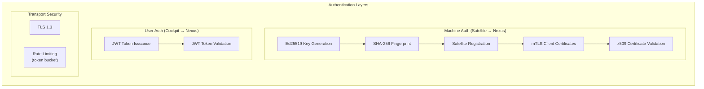

# Security Model

> Authentication, authorization, transport security, and security best practices.

---

## Security Architecture

DAAO implements a layered security model with distinct authentication mechanisms for machine-to-machine (Satellite↔Nexus) and user-to-service (Cockpit↔Nexus) communication.

---

## Satellite Authentication (mTLS)

Satellites authenticate to Nexus using **mutual TLS (mTLS)** with Ed25519 key pairs and x509 client certificates.

### Key Storage

Keys are stored at platform-specific default paths:

| Platform | Public Key | Private Key |
|---|---|---|
| Linux/macOS | `~/.daao/satellite.pub` | `~/.daao/satellite.key` |
| Windows | `%APPDATA%\daao\satellite.pub` | `%APPDATA%\daao\satellite.key` |

---

## User Authentication (JWT)

Users authenticate via **JWT tokens**. The Cockpit web UI sends credentials and receives a JWT for subsequent API calls.

### Configuration

| Parameter | Default | Description |
|---|---|---|
| `JWT_SECRET` | (must be set) | HMAC-SHA256 signing key |
| `JWT Issuer` | `daao-nexus` | JWT `iss` claim |

> [!CAUTION]
> **You must set a strong, random `JWT_SECRET` in production.** Use `openssl rand -base64 32` to generate one. Nexus will log a warning if it detects a known-weak default.

---

## Role-Based Access Control (RBAC)

DAAO implements a three-role RBAC model to control user access. RBAC is enforced server-side; client-side permission checks are for UI gating only.

### Role Hierarchy

| Role | Description |
|------|-------------|
| `owner` | Full control — manage users, roles, all resources |
| `admin` | Operational control — manage sessions, satellites, agents (no user management) |
| `viewer` | Read-only — view sessions, recordings, telemetry (own resources only) |

A user **inherits all permissions of lower roles**.

### Permission Matrix

| Action | viewer | admin | owner |
|--------|--------|-------|-------|
| View own sessions/satellites | ✅ | ✅ | ✅ |
| View all sessions/satellites | ❌ | ✅ | ✅ |
| Create/kill/suspend sessions | Own only | ✅ | ✅ |
| Manage satellites | Own only | ✅ | ✅ |
| Deploy agents | ❌ | ✅ | ✅ |
| List all users | ❌ | ✅ | ✅ |
| Invite/delete users | ❌ | ❌ | ✅ |
| Change user roles | ❌ | ❌ | ✅ |
| Request role upgrade | ✅ | ✅ | — |

### Dev Mode (No OIDC)

When `OIDC_ISSUER_URL` is not set, Nexus operates in single-user mode. The first user is bootstrapped as `owner` using the `DAAO_OWNER_EMAIL` environment variable. RBAC checks are still enforced.

---

## Transport Security

| Connection | Protocol | Security |
|---|---|---|
| Satellite ↔ Nexus (gRPC) | TLS 1.3 | mTLS with Ed25519 client certs |
| Cockpit ↔ Nexus (REST) | HTTPS | JWT Bearer tokens |
| Cockpit ↔ Nexus (Terminal) | WebSocket (WSS) | TLS 1.3 + JWT |
| Cockpit ↔ Nexus (SSE) | HTTPS | HttpOnly cookie (`daao_auth`) |
| Cockpit ↔ User (Push) | Web Push | VAPID encryption |

---

## Licensing

DAAO uses Ed25519-signed JWT license keys. Enterprise features require a valid license key signed by the DAAO licensor.

| Env Var | Description |
|---------|-------------|
| `DAAO_LICENSE_KEY` | The signed JWT license token |
| `DAAO_LICENSE_KEY_FILE` | Path to file containing the JWT |

> [!NOTE]
> Enterprise features are currently in development and not yet available for production use. See [ROADMAP.md](ROADMAP.md) for planned timeline.

---

## Agent Safety

The following agent guardrails are available in **all tiers** (Community, Team, Enterprise):

| Guardrail | Tier | Description |
|-----------|------|-------------|
| Tool allow/deny lists | Community+ | Restrict which tools an agent can call |
| Read-only mode | Community+ | Prevent agents from executing write operations |
| Timeout limits | Community+ | Auto-kill agents that run too long |
| Max tool call limits | Community+ | Prevent infinite tool loops |
| **Path jailing** | Community+ | Blocks writes outside context dir + temp dir |
| **Dynamic prompt injection** | Community+ | Injects OS, architecture, context dir at deploy-time |
| **Working directory sandbox** | Community+ | Relative paths resolve within context dir |
| **HITL approval gates** | **Enterprise** | Human-in-the-loop modal for risky commands (coming soon) |
| **Event triggers** | **Enterprise** | Telemetry-driven agent invocation (coming soon) |
| **Agent chaining** | **Enterprise** | Pipeline workflows across agents (coming soon) |

**Environment variables injected into agent processes:**

| Env Var | Description |
|---------|-------------|
| `DAAO_CONTEXT_DIR` | Absolute path to the satellite's context directory |
| `DAAO_ALLOWED_DIRS` | OS-separated list of dirs the guardrails extension permits writes to |

> [!IMPORTANT]
> Path jailing is enforced at **three layers**: Go-level validation, system prompt instruction, and the `daao-guardrails` extension. Defense in depth — no single layer is trusted alone.

---

## Admin Audit Trail

All state-changing admin actions are logged to an immutable audit trail:

| Action | Status |
|--------|--------|
| Session create/kill/suspend | ✅ Logged |
| Agent deploy/kill | ✅ Logged |
| Satellite delete/rename | ✅ Logged |
| Provider config changes | ✅ Logged |
| Context file edits | ✅ Logged |

---

## Production Hardening Checklist

### Secrets & Authentication

- [ ] Set a strong, random `JWT_SECRET` (≥ 256 bits): `openssl rand -base64 32`
- [ ] Set `DAAO_SECRET_KEY` for persistent encrypted secrets storage
- [ ] Set `DAAO_OWNER_EMAIL` to the operator's email for owner user bootstrap
- [ ] Set `DAAO_LICENSE_KEY` with a valid enterprise license (if applicable)

### TLS & Certificates

- [ ] Replace self-signed TLS certificates with CA-signed ones
- [ ] Set up certificate rotation schedule for satellite mTLS certificates
- [ ] Enable `sslmode=require` on `DATABASE_URL`

### Network & Access

- [ ] Run Nexus behind a reverse proxy (Nginx, Caddy, Traefik) with TLS termination
- [ ] Set `DAAO_ALLOWED_ORIGINS` to your Cockpit domain(s) for WebSocket/WebTransport origin validation
- [ ] Remove PostgreSQL port exposure (`5432`) from public-facing networks
- [ ] Place Nexus on an isolated network segment
- [ ] Configure rate limit thresholds appropriate for your workload

### Database

- [ ] Use a dedicated PostgreSQL user with minimum required privileges
- [ ] Enable audit logging in PostgreSQL (`log_statement = 'mod'` minimum)
- [ ] Set up automated backups with encryption at rest
- [ ] Test backup restoration procedures

### Monitoring

- [ ] Monitor Nexus health endpoint (`/health`) with external uptime checker
- [ ] Set alerts for authentication failures (brute force detection)
- [ ] Set alerts for rate limit threshold breaches
- [ ] Monitor satellite heartbeat loss events

---

## Reporting Security Issues

If you discover a security vulnerability, please **do not open a public GitHub issue**. Instead, email **security@daao.dev** with details. We will respond within 48 hours and coordinate a fix before public disclosure.
